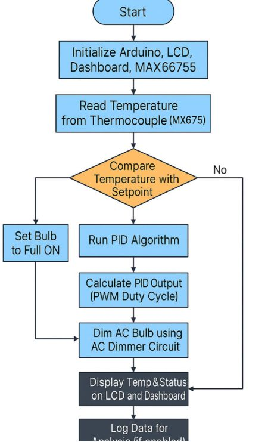
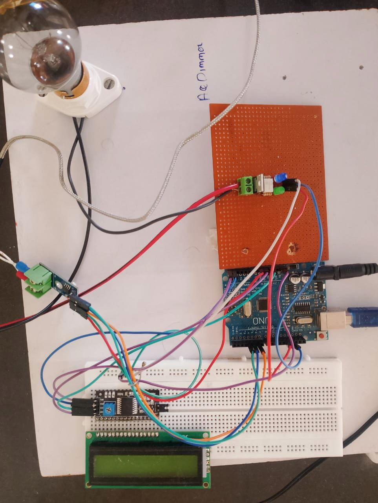
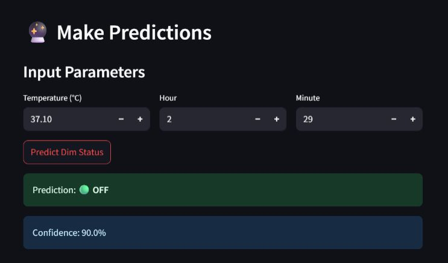

# Hybrid Temperature Control System (PID + TRIAC + ML)

## Overview
This project implements a closed-loop temperature control system using an
Arduino-based PID controller and TRIAC-based AC power control.

The system compares multiple temperature sensors (LM35, RTD, Thermocouple),
performs real-time monitoring using a Streamlit dashboard, and integrates
machine learning models to predict temperature behavior and control actions.

## Objectives
- Design a stable PID-based temperature control system
- Control AC load using TRIAC phase-angle control
- Compare temperature sensors based on performance
- Visualize system behavior in real time
- Apply machine learning for predictive temperature control

## System Architecture
**Flow:**  
Sensor → Arduino → PID Controller → TRIAC Dimmer → Heater  
Sensor Data → Python → ML Model → Streamlit Dashboard

## Hardware Components
- Arduino Uno
- K-Type Thermocouple + MAX6675
- LM35 Temperature Sensor
- RTD (PT100)
- BT136 TRIAC
- MOC3021 Opto-isolator
- 25W AC bulb (heater)
- 16x2 LCD Display
- Potentiometer

## Software & Tools
- Arduino IDE
- Python
- Streamlit
- Scikit-learn
- Pandas & Matplotlib

## PID Control Logic
The PID controller continuously calculates the error between the setpoint
and measured temperature.

Based on the PID output, the TRIAC firing angle is adjusted to smoothly
control AC power, reducing overshoot and oscillations compared to ON/OFF control.

## Sensor Comparison
| Sensor | Range | Response Time | EMI Immunity | Verdict |
|------|------|--------------|-------------|--------|
| LM35 | Low | Slow | Poor | ❌ |
| RTD | Medium | Moderate | Good | ⚠️ |
| Thermocouple | Very High | Fast | Excellent | ✅ |

Thermocouples performed best under TRIAC switching conditions due to
high temperature range and strong EMI immunity.

## Machine Learning Integration
Temperature data was logged at 1-second intervals and used to train
machine learning models.

**Best model:** Random Forest  
- R² ≈ 0.96  
- MAE ≈ 0.23 °C  

The model predicts future temperature trends and control states.

## Real-Time Dashboard
A Streamlit dashboard provides:
- Live temperature plots
- PID controller status
- Sensor comparison
- ML-based prediction output

## Results
- Reduced overshoot compared to relay-based control
- Faster thermal response
- Improved system stability
- Accurate temperature prediction using ML

## Applications
- Industrial heaters and furnaces
- HVAC systems
- Smart thermal management
- Educational control laboratories

## Future Scope
- IoT integration (MQTT / OPC-UA)
- Auto-tuning PID
- Deep learning for time-series prediction
- Industrial deployment

## License
This project is licensed under the MIT License.

